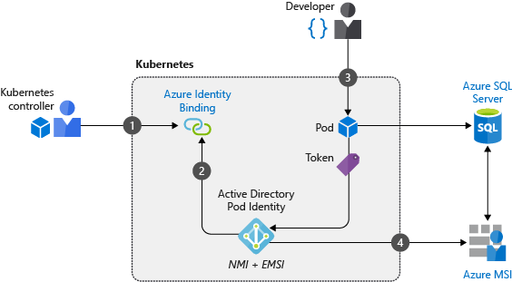

# Introduction

AAD Pod Identity enables containerized applications in AKS cluster to access services that uses Azure Active Directory (AAD) as an identity provider. It supports assigning following types of identities to pod. 

- `type: 0` - User Assigned Managed Identity
- `type: 1` - Service Principal with Secret
- `type: 2` - Service Principal with Certificate

In AKS, two components are deployed to allow pods to use managed identities:

- The **Node Management Identity (NMI) server** is a pod that runs as a DaemonSet on each node in the AKS cluster. The NMI server listens for pod requests to Azure services.
- The **Managed Identity Controller (MIC)** is a central pod with permissions to query the Kubernetes API server and checks for an Azure identity mapping that corresponds to a pod.

In the following example, we create a pod that uses a managed identity to request an access token. Application can use that token to access any service integrated with Azure Active Directory:



1. Cluster operator first creates a service account that can be used to map identities when pods request access to services.
2. The NMI server and MIC are deployed to relay any pod requests for access tokens to Azure AD.
3. A developer deploys a pod with a managed identity that requests an access token through the NMI server.
4. The token is returned to the pod and used to access Azure resources

> For more details, refer [AAD Pod Identity](https://github.com/Azure/aad-pod-identity) github page.

# Role Assignment

AKS cluster will need the correct role assignment configuration to perform Azure-related operations such as assigning and un-assigning the identity on the underlying `VMSS`. Run the following commands to help you set up the appropriate role assignments for your cluster identity before deploying `aad-pod-identity`.

> This step may fail due to insufficient privileges to perform role assignment. Raise support ticket with Cloud Ops for necessary role assignments. For mode details, refer [Role Assignment](https://github.com/Azure/aad-pod-identity/blob/master/docs/readmes/README.role-assignment.md).

```sh
export SUBSCRIPTION_ID="<SubscriptionID>"
export RESOURCE_GROUP="<AKSResourceGroup>"
export CLUSTER_NAME="<AKSClusterName>"
export CLUSTER_LOCATION="<AKSClusterLocation>"

# if you are planning to deploy your user-assigned identities in a separate resource group
export IDENTITY_RESOURCE_GROUP="<IdentityResourceGroup>"

./scripts/role-assignment.sh
```

# Install AAD Pod Identity

Deploy `aad-pod-identity` components to an RBAC-enabled cluster using `Helm3`. This will also create `AzureIdentity` and `AzureIdentityBinding` objects which are used to assing a User Assigned Managed Identity (UAMI) as pod identity.

> Override `charts/values.yaml` with your environment specific values. For more details, refer [chart overrides](https://github.com/Azure/aad-pod-identity/tree/master/charts/aad-pod-identity#configuration).

```sh
helm repo add aad-pod-identity https://raw.githubusercontent.com/Azure/aad-pod-identity/master/charts
helm upgrade --install aad-pod-identity aad-pod-identity/aad-pod-identity -n kube-system -f charts/values.yaml
```

```
OUTPUT:

manifest_sorter.go:192: info: skipping unknown hook: "crd-install"
manifest_sorter.go:192: info: skipping unknown hook: "crd-install"
manifest_sorter.go:192: info: skipping unknown hook: "crd-install"
manifest_sorter.go:192: info: skipping unknown hook: "crd-install"
NAME: aad-pod-identity
LAST DEPLOYED: Thu Sep 17 23:34:26 2020
NAMESPACE: kube-system
STATUS: deployed
REVISION: 1
TEST SUITE: None
```

> Ignore `skipping unknown hook: "crd-install"` warning message. `Helm3` removed support `crd-install` hook, and this is simply a warning message. It is used for backward compatibility with `Helm2`.

Verify the CRDs created for AAD Pod Identity.

```sh
kubectl get crds -l app.kubernetes.io/name=aad-pod-identity

OUTPUT:

NAME                                               CREATED AT
azureassignedidentities.aadpodidentity.k8s.io      2020-09-17T18:04:23Z
azureidentities.aadpodidentity.k8s.io              2020-09-17T18:04:23Z
azureidentitybindings.aadpodidentity.k8s.io        2020-09-17T18:04:23Z
azurepodidentityexceptions.aadpodidentity.k8s.io   2020-09-17T18:04:23Z
```

Verify the deployment for AAD Pod Identity.

```sh
kubectl get all -l app.kubernetes.io/name=aad-pod-identity -n kube-system

OUTPUT:

NAME                                        READY   STATUS    RESTARTS   AGE
pod/aad-pod-identity-mic-7c968d7b4d-dsbfp   1/1     Running   0          25m
pod/aad-pod-identity-mic-7c968d7b4d-hm9wm   1/1     Running   0          25m
pod/aad-pod-identity-nmi-7jmbk              1/1     Running   0          25m
pod/aad-pod-identity-nmi-ckxl5              1/1     Running   0          25m
pod/aad-pod-identity-nmi-qjklb              1/1     Running   0          25m

NAME                                  DESIRED   CURRENT   READY   UP-TO-DATE   AVAILABLE   NODE SELECTOR            AGE
daemonset.apps/aad-pod-identity-nmi   3         3         3       3            3           kubernetes.io/os=linux   25m

NAME                                   READY   UP-TO-DATE   AVAILABLE   AGE
deployment.apps/aad-pod-identity-mic   2/2     2            2           25m

NAME                                              DESIRED   CURRENT   READY   AGE
replicaset.apps/aad-pod-identity-mic-7c968d7b4d   2         2         2       25m

```

Verify the `AzureIdentity` and `AzureIdentityBinding` objects deployed.

```sh
$ kubectl get AzureIdentity,AzureIdentityBinding -n kube-system

OUTPUT:

NAME                                                 AGE
azureidentity.aadpodidentity.k8s.io/vault-identity   2d16h

NAME                                                                AGE
azureidentitybinding.aadpodidentity.k8s.io/vault-identity-binding   2d16h
```

# Deploy App with Pod Identity

Deploy the following manifest to create test pod with AzureIdentityBinding.

```yaml
cat << EOF | kubectl apply -f -
apiVersion: v1
kind: Namespace
metadata:
  name: pod-identity-test
  labels:
    app: pod-identity-test
---
apiVersion: v1
kind: Pod
metadata:
  name: pod-identity-test
  namespace: pod-identity-test
  labels:
    app: pod-identity-test
    aadpodidbinding: <AZURE_IDENTITY_BINDING_SELECTOR>  # specify the selector defined in AzureIdentityBinding
spec:
  containers:
    - name: test
      image: busyboxplus:curl
      command: ["/bin/sh", "-ec", "while :; do echo 'running...'; sleep 30 ; done"]
      resources:
        requests: # minimum resources required
          cpu: 125m
          memory: 128Mi
        limits: # maximum resources allocated
          cpu: 250m
          memory: 256Mi
  restartPolicy: Never
EOF
```

```
OUTPUT:

namespace/pod-identity-test created
pod/pod-identity-test created
```

Managed Identity Controller will be watching for pods with `aadpodidbinding` label, and once it finds a matching pod, it will assign the UAMI assigned in `AzureIdentity` to the nodepool (VMSS) where the pod is scheduled. 

1. Open Azure Portal and navigate to your AKS cluster's managed resource group (prefeix `MC_`). 
2. Select the node pool where the test pod is scheduled.
3. Under `Settings`, select `Identiy` menu. 
4. Under `User assigned` tab, you will find UAMI assigned in `AzureIdentity`.
5. Select UAMI, and verify the details.
6. Copy the value in `Client ID` to be used in following test. 


# Test App with Pod Identity

Run following command from Test pod to generate `jwt` token using the configured Azure Identity. Following command should return a valid `access_token`.

```sh
$ curl -H Metadata:true "http://169.254.169.254/metadata/identity/oauth2/token?api-version=2018-02-01&resource=https%3A%2F%2Fmanagement.azure.com/&client_id=<UAMI CLIENT ID>"

OUTPUT:

{"access_token":"eyJ0e*******************************nRMQ","refresh_token":"","expires_in":"86399","expires_on":"1600515495","not_before":"1600"}
```

# Cleanup

## Uninstall App 

```sh
kubectl delete ns pod-identity-test
```

## Uninstall AAD Pod Identity

To uninstall/delete the last deployment:

```sh
helm uninstall aad-pod-identity -n kube-system
```

The CRD created by the helm chart are not removed by default and should be manually cleaned up (if required)

```sh
kubectl delete crds -l app.kubernetes.io/name=aad-pod-identity
```
