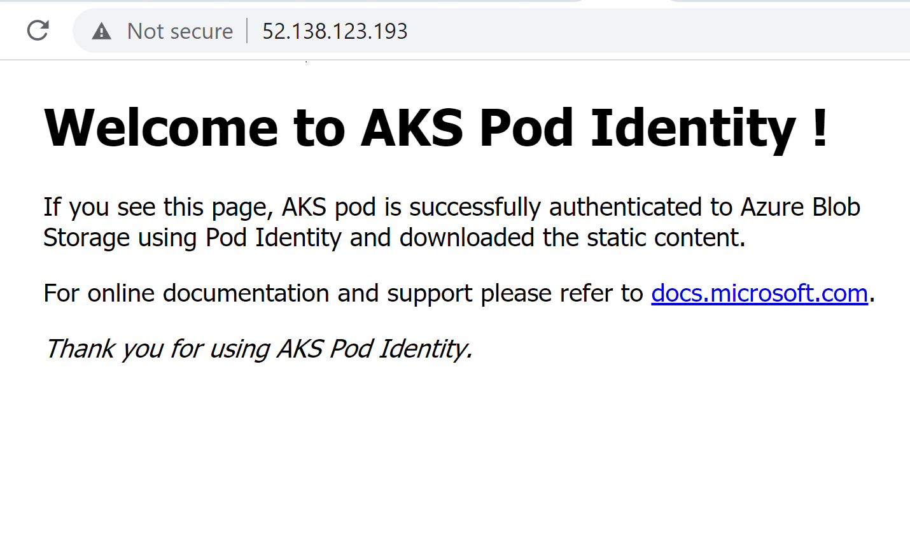

# Access Blob using Pod Identity

In this example, we will be assigning user managed identity to a pod which will download static web content from Azure blob storage. Pod is made of 2 containers.

- **blob-loader** - Init container generates access token using pod identity, downloads blob from Azure storage, and stores it as a file in a volume shared with main container.
- **nginx** - Main container uses the web content in the shared volume and renders it as a web page.

> Note: This example doesn't use any secrets like `storage_access_key`, so there is no need for secret providers (Kubernetes secrets, Azure key vault, etc).

## Deploy

Set environment defaults.

```sh
SUBSCRIPTION_ID=<my-subsscription-id>
RESOURCE_GROUP=<my-aks-rg>
LOCATION=eastus2
CLUSTER_NAME=<my-aks-cluster>
```

Export storage environment vaiables by replacing placeholders with your blob store details. They will be used later while applying kubernetes manifest. 

```sh
export STORAGE_ACCOUNT=<my-storage-account>
export CONTAINER=<my-container-name>
export BLOB=<my-blob-name>
```

Create a general-purpose storage account and a blob container 

```sh
az storage account create \
    --resource-group $RESOURCE_GROUP \
    --name $STORAGE_ACCOUNT \
    --location $LOCATION \
    --encryption-services blob
az storage container create  \
    --name $CONTAINER \
    --account-name $STORAGE_ACCOUNT
```

Upload test blob to storage container.

```sh
az storage blob upload \
    --account-name $STORAGE_ACCOUNT \
    --container-name $CONTAINER \
    --name $BLOB \
    --file blobs/index.html 
```
 
Create a user assigned identity for retreiving blob from Azure Storage.

```sh
IDENTITY=<my-blob-identity>
az identity create \
    --resource-group $RESOURCE_GROUP \
    --name $IDENTITY
PRINCIPAL_ID=$(az identity show --resource-group $RESOURCE_GROUP  --name $IDENTITY --query 'principalId' -o tsv)
```

Assign `Storage Blob Data Reader` role to the user assigned identity to access blob.

> 💡 Role assignment should follow the least privilege required for completing a given operation. 
```sh
STORAGE_ACCOUNT_ID=/subscriptions/$SUBSCRIPTION_ID/resourceGroups/$RESOURCE_GROUP/providers/Microsoft.Storage/storageAccounts/$STORAGE_ACCOUNT
az role assignment create \
    --assignee $PRINCIPAL_ID \
    --role 'Storage Blob Data Reader' \
    --scope $STORAGE_ACCOUNT_ID
```

Create pod identity for the cluster using `az aks pod-identity add` command.

```sh
IDENTITY_ID=/subscriptions/$SUBSCRIPTION_ID/resourcegroups/$RESOURCE_GROUP/providers/Microsoft.ManagedIdentity/userAssignedIdentities/$IDENTITY
az aks pod-identity add --resource-group $RESOURCE_GROUP \
    --cluster-name $CLUSTER_NAME \
    --namespace 'nginx-blob-test'  \
    --name 'blob-identity' \
    --identity-resource-id $IDENTITY_ID
```

Deploy `manifests/nginx-blob-test.yaml` to create a sample app which retrieves a blob from Azure Storage using pod identity. 

`envsubst` command will substitue placeholders in kubernetes manifest with storage environment variables created above.

> Note: This manifest configures pod to use an identity by assigning this label - `aadpodidbinding: blob-identity`.

```sh
envsubst '${STORAGE_ACCOUNT} ${CONTAINER} ${BLOB}' < manifests/nginx-blob-test.yaml | kubectl apply -f -
```

Check whether the `nginx-blob-test` app is running. Wait till `EXTERNAL-IP` for `nginx-blob-test-svc` is generated.

```sh
kubectl get all -n nginx-blob-test
```

```
OUTPUT:

NAME                                   READY   STATUS    RESTARTS   AGE
pod/nginx-blob-test-65fdb6c449-gpdlh   1/1     Running   0          49s

NAME                          TYPE           CLUSTER-IP    EXTERNAL-IP      PORT(S)        AGE
service/nginx-blob-test-svc   LoadBalancer   10.0.251.49   52.138.123.193   80:30941/TCP   8h

NAME                              READY   UP-TO-DATE   AVAILABLE   AGE
deployment.apps/nginx-blob-test   1/1     1            1           8h

NAME                                         DESIRED   CURRENT   READY   AGE
replicaset.apps/nginx-blob-test-65fdb6c449   1         1         1       50s
```

## Test

Open the `EXTERNAL_IP` in a browser to display static web content from `nginx-blob-test` service.



Inspect the `nginx-blob-test` pod to check whether `index.html` blob is created as a file in `/usr/share/nginx/html/` path.

```sh
kubectl exec -it -n nginx-blob-test $(kubectl get pods -n nginx-blob-test -l app=nginx-blob-test -o jsonpath='{.items[0].metadata.name}') -- sh

/ # cd /usr/share/nginx/html/
/usr/share/nginx/html # ls
index.html
/usr/share/nginx/html # cat index.html
<!DOCTYPE html>
<html>

<head>
    <title>Welcome to AKS Pod Identity !</title>
    <style>
        html {
            color-scheme: light dark;
        }

        body {
            width: 35em;
            margin: 0 auto;
            font-family: Tahoma, Verdana, Arial, sans-serif;
        }
    </style>
</head>

<body>
    <h1>Welcome to AKS Pod Identity !</h1>
    <p>If you see this page, AKS pod is successfully authenticated to Azure Blob Storage
        using Pod Identity and downloaded the static content.</p>

    <p>For online documentation and support please refer to
        <a href="https://docs.microsoft.com/en-us/azure/aks/use-azure-ad-pod-identity/">docs.microsoft.com</a>.
    </p>

    <p><em>Thank you for using AKS Pod Identity.</em></p>
</body>

</html>/usr/share/nginx/html # exit
```

## Cleanup

Uninstall `nginx-blob-test` application 

```sh
kubectl delete -f manifests/nginx-blob-test.yaml
```

Delete `nginx-blob-test` namespace

```sh
kubectl delete ns nginx-blob-test
```

Delete resource group

```sh
az group delete --name $RESOURCE_GROUP
```
